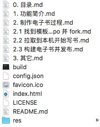
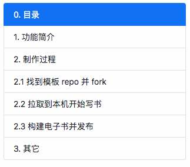

功能简介 {: .text-center }
---------------------

&nbsp;

### fnw-easy-book 介绍

fnw-easy-book 是一种简易电子书工具，该项目已在 [github.com/fn-share/fnw-easy-book](https://github.com/fn-share/fnw-easy-book) 开源。项目名中 fnw 前缀表示它是 `Fork and Write` 家族系列工具中的一员，`easy-book` 是工具名，后面我们简称为 EasyBook 工具。

`Fork and Write` 系列工具有如下通行特征：

1. 用 repo 项目的形式组织待编辑内容（如博客、电子书、演示胶片、流程图等），通常在项目中用一个或多个 md 文件表达用户撰写的内容。
2. 样例 repo 均在 `github.com` 开源。
3. 用户通常通过选择样例 repo，fork 到自己的 repo 库目录下，然后编辑自己的 md 文件。
4. 这类工具通常还配套提供可视化的编辑环境，还配置若干命令行工具让内容整理、转换、发布等操作更方便。

EasyBook 是一种简易电子书的编辑工具与发布工具，用它创建内容如 [官方样板站点](https://fn-share.github.io/fnw-easy-book/index.html) 呈现的样子，本手册也是用这个工具生成的 。

&nbsp;

### 最简使用

先拉取样例 repo 到本地。

``` bash
git clone https://github.com/fn-share/fnw-easy-book.git
```

在本机启动 web server。

``` bash
cd fnw-easy-book
python3 http_server 8000
```

在浏览器打开本地网址 `http://localhost:8000/index.html`，电子书的网页状态立即呈现。

用户自行编辑项目目录下的 md 文件，除 README 外，其它都是电子书内容页定义，文件列表如下图：



各项 md 文件与最终电子书的章节目录具有一一对应关系，请与下图作对比。



之后开始撰稿，用户可以增删 md 文件，在 md 中用 markdown 语法编辑书稿内容。完稿后，运行如下命令以便更新 `config.json` 配置文件，配置文件用来定义电子书标题、作者、章节列表等内容。

``` bash
python3 build
```

然后用 `git push` 命令将本机的电子书提交到 `github.com` 发布，如果本 repo 在 github 配置 GitHub Pages 选项，本电子书还自动发布到 `github.io` 托管站，详情在后文介绍。
