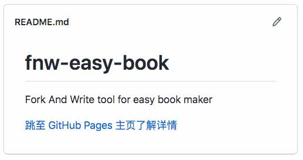
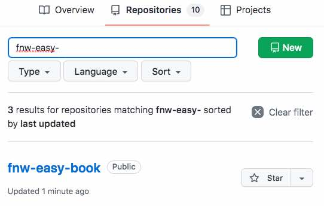
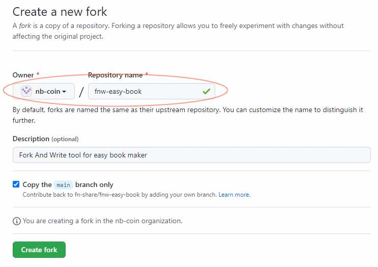
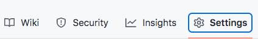
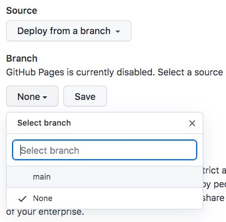

找到模板 repo 并 fork {: .text-center }
---------------------------------

&nbsp;

### 模板项目

同一份 Fork and Write 工具，可能在 github 上提供多份模板，比方 [fnw-tools/fnw-easy-book](https://github.com/fnw-tools/fnw-easy-book) 是 EasyBook 的一份模板，其它模板也在 github 上以 repo 方式提供。

这些模板均按 [GitHub Pages](https://pages.github.com/) 静态页方式在 github 托管，用户在 github 网站找到相应 repo 后，点击类似下图的 README 中 “跳至 GitHub Pages 主页了解详情” 链接，浏览器随即打开该项目托管的 GitHub Pages 主页。

然后，模板（电子书）发布后的界面将立即呈现 。

&nbsp;

### 选择模板

先在网页打开 Federation Knowledge Sharing 在 github 的开源主页，切换到 repo 列表页，不妨 [点击此链接](https://github.com/fnw-tools?tab=repositories)。然后在 "Find a repository" 搜索框输入 `fnw-`，当前 FNS 官方已提供的 Fork and Write 工具即被过滤出来，进一步输入 `fnw-easy-` 过滤范围将再收窄。

同类工具的的项目名，将以尾缀表达，比如 `fnw-easy-book, fnw-easy-book2, fnw-easy-book3` 都是 EasyBook 的模板工具，选不同模板会让发布后产品的界面稍有差异。用户可以选择一个合适的 repo，接下来将它 fork 到自己名下 。

&nbsp;

### fork 模板项目

找到模板 repo 后，点击页面右上方的 Fork 按钮，将此项目 fork 到自己的空间下，在如下界面通常要改一下项目名称，按自己想撰写电子书的主题去命名。

然后在 fork 后的项目主页，点击 Settings 按钮进入配置页面。

在配置页面的左边栏选择 Pages 项，然后在 Build and deployment 配置项下，指定将当前项目的哪个分支及哪个目录发布到 GitHub Pages 站点。

我们选择 main 分支，及 "(root)" 根目录，之后点 Save 按钮保存刚做的修改。

上述操作不仅让用户复制一个 repo，还指定复制后的 repo 作为静态页托管到 "github.io" 站点。等 github 服务器构建 GitHub Pages 完成（通常小于 10 分钟），我们切换到目标 repo 的 README 主页，点击 “跳至 GitHub Pages 主页了解详情” 链接应能打开用户自己的电子书主页了。

