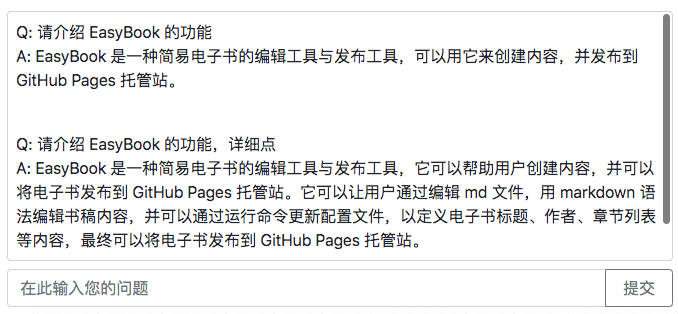

管理问答框 {: .text-center }
----------

&nbsp;

### EasyBook 缺省已集成 FNS quoto 服务

[FNS quoto](https://quoto.fn-share.com) 是提供知识问答的一项免费服务，如果当前 EasyBook 已打开问答控件，一个提问框与回答文本区将显示在电子书的首个文档（通常是目录页）中，如下图。

在提问框输入一个问题，比方针对本书，“请介绍 EasyBook 的功能”，击回车或点提交按钮后系统将返回一段答复。注意，提问需针对当前电子书提出，无关问题将得到 “我不知道” 的回复 。

&nbsp;

### 如何布署问答服务？

缺省情况下 fork 本模板，quoto 问答服务已自动开启，如果找不到提问框，请检查项目的 config.json 文件，看看 show_quoto 选项是否置为 1。

任何问题从 提问框 提交后，系统就自动到 [quoto.fn-share.com](https://quoto.fn-share.com) 网站查询答案。首次提问时 quoto.fn-share.com 将自动为当前电子书建立索引，因为建索引需要时间，所以首次提问很容易因超时而失败，不过，当索引就绪后问答就表现正常了 。

如果电子书内容有修改，请按如下方法重新布置，quoto 服务也同步更新索引。

- 第一步，修改 config.json 文件中的 ver 选项，升级一下版本号，比如从 "0.1" 版本升级到 "0.2"
- 第二步，按前一节 [构建电子书并发布](#2.3) 的指示完成构建以及在静态网站重新布署
- 第三步，在 quoto 提问框提交 update 指令，即，输入 `$ update` 后提交，服务站完成更新一般要等 2 小时 。

上述 `$ update` 是 quoto 问答服务的内置指令，用户可以输入 help 获得更多帮助（提交 `$ help` 指令），另外，提交 `$ info` 指令可查询当前电子书在用索引的版本号。

&nbsp;

### 如何取消 quoto 问答服务？

如果想关闭问答窗口，只需将 config.json 文件中的 show_quoto 值从 1 改成 0，然后重新构建、布署电子书即可。布署后，您将发现提问框与问答文本自动隐藏了。
